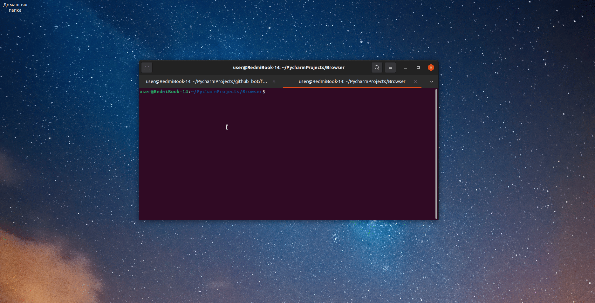

# Browser
<b> Your own browser written in python.</b>
<p>
  
  
  
  
  
  

  
  
  
</p>


Read in other languages: [English](README.md), [हिन्दी](README.hindi.md), [Russian](README.ru.md)





##如何安裝和運行
____
### 克隆存儲庫
 
```sh
$ cmd
$ git clone https://github.com/BEPb/Browser
$ cd Browser
```
 
### 安裝必要的包（安裝依賴）
```sh
$ pip install -r requirements.txt
```

＃＃ 用法
要啟動 GUI：
```
python3 -m main
```


＃＃ 項目發展
歡迎提出項目開發請求。 對於重大更改，請先打開一個問題，以便
討論你想改變什麼。
____

＃＃ 執照


[MIT](LICENSE.txt)

____

